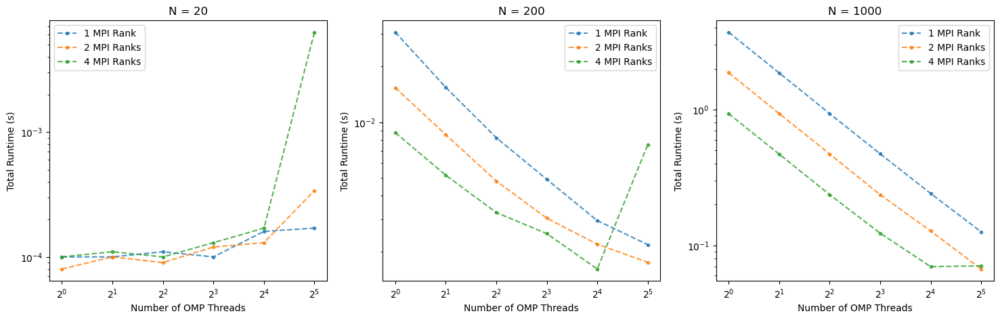

## Part 1: OpenMP Matrix-Matrix Multiplication
The parallelism can be applied to the outermost loop, as follows:
 ```
 #pragma omp parallel for
for (i = 0; i < N; i++) {
  for (j = 0; j < N; j++) {
    for (k = 0; k < N; k++) {
      C[i*N+j] += A[i*N+k] * B[k*N+j];
    }
  }
}
 ```
 The j and k loops are not threadable because they have dependencies between iterations that require synchronization, which would lead to significant overhead in a threaded implementation.

  1. The code can be found in this repository. As the function 'MPI_Wtime' is used to measure the elapsed time, the codes are built with this command:
  ```
  mpicxx -fopenmp -o part1-OMP part1.cpp
  ```
  2. The performance is very similar in both cases. However, due to some small overhead, the OpenMP case takes a bit longer. For instance, when N = 200, the serial case gets executed in 33 ms, while the OpenMP case with 1 thread takes 37 ms to be run.
  3. On amd20, for threads from 1 to 128, the code got executed 10 times for each matrix sizes of `N=20, 100, 1000`.
  4. The average value of the 10 executions has been used to plot the results. In addition, the standard deviation is shown in the figure. As you can see, for `number of OMP threads = 32, 64`, some outliers exists in the data.
  
  5. The difference between the results of the serial run and the parallel run with 128 threads was calculated by subtracting the two sets of outputs and summing over all components. The final result was zero, indicating that the solution is independent of the number of threads.
  
## Part2: Adding OpenMP threading to a simple MPI application
The output looks like this:
```
Hello, World! Hello, World! Hello, World! from rank: Hello, World! from rank: 1 and from thread: 1 and from thread: 3from rank: from rank: 1 and from thread: 211
 and from thread: 

0
Hello, World! from rank: Hello, World! from rank: Hello, World! from rank: 0 and from thread: 3Hello, World! from rank: 0 and from thread: 0

0 and from thread: 2
0 and from thread: 1
```
The output is scrambled due to race conditions between the threads. Since multiple threads are trying to write to the standard output (stdout) simultaneously, it is possible for their outputs to overlap and produce this scrambled output.

## Part 3: Hybrid Parallel Matrix Multiplication
There is no difference between the serial and parallel output. Therefore, the code is verified. For matrix size of `N = 20, 200, 1000`, `threads per rank = 1, 2, 4, 8, 16, 32`, and `Number of MPI ranks = 1, 2, 4`, The code got executed. The results are shown below.

