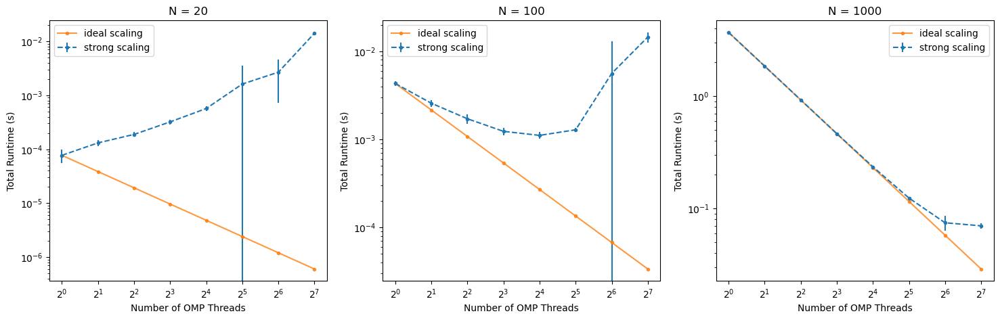

## Part 1: OpenMP Matrix-Matrix Multiplication
The parallelism can be applied to the outermost loop, as follows:
 ```
 #pragma omp parallel for
for (i = 0; i < N; i++) {
  for (j = 0; j < N; j++) {
    for (k = 0; k < N; k++) {
      C[i*N+j] += A[i*N+k] * B[k*N+j];
    }
  }
}
 ```
 The j and k loops are not threadable because they have dependencies between iterations that require synchronization, which would lead to significant overhead in a threaded implementation.

  1. The code can be found in this repository. As the function 'MPI_Wtime' is used to measure the elapsed time, the codes are built with this command:
  ```
  mpicxx -fopenmp -o part1-OMP part1.cpp
  ```
  2. The performance is very similar in both cases. However, due to some small overhead, the OpenMP case takes a bit longer. For instance, when N = 200, the serial case gets executed in 33 ms, while the OpenMP case with 1 thread takes 37 ms to be run.
  3 and 4. The plot is shown below:
  
